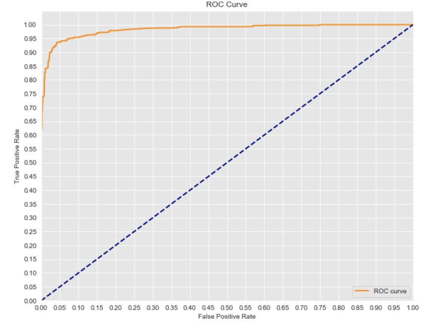

# Analyzing Medicaid Drug Prices

## Motivation

It is well known that pharmaceutical drug prices in the U.S. are disproportionately high relative to other wealthy nations. Our goal was to find if there's a a way to model certain pharmaceutical drugs that are consistenty overpriced relative to some market average.

## Thesis

Using the data captured within this database and other drug categorization element, can we predict whether or not a drug will be above or below the FUL? 

We used a variety of machine learning models with varying results, but our most successful models were SVM with a **95.2% accuracy score** and a **95.1% F1-Score** and logistic regression to come up with a **94.2% accuracy score** and a **93.9% F1-Score.**

## The Data

We discovered a trove of data through the National Bureau of Economic Research, a private, non-profit, non-partisan organization dedicated to conducting economic research and to disseminating research findings among academics, public policy makers, and business professionals. They have a database that keeps track of drugs used by Medicaid, certain drug metadata, the average market rate, and whether or not the drug's price paid was above or below the Federal Upper Limit.

For background, the Federal Upper Limited (or "FUL") is the maximum reimbursement amount allowed for certain drugs pursuant to Section 1927(e) of the Social Security Act (Act). The FUL requirement was created in 1987 in an effort to ensure that Medicaid was a prudent purchaser and its calculation was updated with the Affordable Care Act. 

Links to Data Sources: 

    Database: http://www.nber.org/data/federal-upper-limits/2017/
    
    FUL Explainer: https://www.dhcs.ca.gov/provgovpart/pharmacy/Pages/ACAFUL.aspx
    
    Database Explainer:  https://www.medicaid.gov/medicaid-chip-program-information/by-topics/prescription-drugs/true-up/xxxxxdraft-true-up-methodology.pdf

## The Process

Our goal was to utilize a variety of machine learning alogrithms to test each one and determine, which one provided the best result. We began with the model that we thought would work best, then worked through other models that we thought would provide an interesting result.

The Ordering of the models and their test results are below:

    - Logistic Regression
        Accuracy: 94.2%
        F1-Score: 93.9%
        Recall: 92.3%
        Precision: 95.6%

    - Advanced Decision Trees
        - GradientBoosing
            Accuracy: 81.7%
            F1-Score: 83.1%
            Recall: 91.9%
            Precision: 75.8%
        - Adaboosting
            Accuracy: 75.3%
            F1-Score: 77.8%
            Recall: 89.0%
            Precision: 69.1%

    
    - Support Vector Machines
        Accuracy: 95.2%
        F1-Score: 95.1%
        Recall: 94.5%
        Precision: 95.7%
    
    - Naive Bayes
        Accuracy: 72.0%
        F1-Score: 77.6%
        Recall: 100%
        Precision: 63.4%

## Data Cleaning

Using Pandas, we scraped NBER's database for information stored for July 2017. We then checked the data to confirm there were no obvious erroenous observations, and began the process of creating dummy variables for the drug ingredient columns. We found 440 unique raw ingrients lists in 15618 observations. Other features included in the base data included strength, dosage, route, dosage type, weighted average market price, and package size.

# Exploratory Data Analysis

Our next step was to analyze and create visualizations of the data to determine the characteristics of our data set. The first item was to check to the balance of our target feature. Fortunately, we found that we had a near equal classification balance, so we did not need to perform any re-sampling analysis.

Next, we wanted to see the diversity and breakdown of values for some of our features. As mentioned there were 440 unique ingredients. A hisogram would be preferable in this situation, but given the number of ingredients, I've chosen to show a snapshot of the most and least frequent ingredients.

As seen from the tables below, while the list of ingredients isn't evenly distributed, we believe don't believe that there is insight to gain from this field.

The other fields tend to be more skewed. For instance, the dosage field has about 70% of its entries are "TABLET," so there's likely not has much infomration to take out of this field and other's like it.  

We were curious to see the accuracy results of our models, based on the insights gained from our EDA. Our ingredient feature set is diverse and long, so we believe that it contains the most potential information to feed our model. The other feature could have information as well, but they don't have the diversity of information for each observation. Therefore, we believe that if our models are accurate, there will likely be a high correlation between a given ingredient and the number of times it goes above or below the FUL.

## Model Preparation

Our first step was to separate out each ingredient from the source column (and separate any combination ingregients) and create a dummy columns for each one. Our initial inclination was to use the auto-dummy creator OneHotEncoder, but we found that certain observations included multiple ingredients, and we wanted to capture each unique ingredient's instance, including if it was combined with another. So, we separated each ingredient into the unique list mentioned above, and then appended it to the dataframe. 

In a similar way, we also dummied the other non-numerical variables. (i.e. Strength, Route, Dosage)

## The Models

As mentioned above, our goal was to implement a variety of machine learning models to observe which models performed the best on this data set, and make suggestions why these results occured. 

We establish a baseline accuracy test by taking the most likely outcome and dividing by the entire data set. In this case, we have 8120 example of an ingredient being below the 175% FUL out of 15,618 observations resulting in a null accuracy of 52.0%. 

### Logistic Regression

The first model we implemented was a logistic regression. We thought that this model would perform the best out of all of them due to its efficiency with binary predictors and translate them into a useful model.

Logistic models don't generally have a need for any scaling, so we fed our model a standard 75/25 train/test split from our dataset. The resulting model gave us the high accuracy scores restated here:

    - Logistic Regression
        Accuracy: 94.2%
        F1-Score: 93.9%
        Recall: 92.3%
        Precision: 95.6%

We viewed this as a very positive result, and so we created the following visualizations to gain more insight into the model. 

First, we printed out a ROC Curve and a Decision Boundary chart. The large area under the curve and clustered areas at the top and bottom of the boundary chart, show that the model is generally confident with its observations, which is backed up by the accuracy scores above.

Below is the print out of the features that had the greatest weights on the model. The uses of these drugs and a full medical use analysis for these drugs were outside of the scope of this project, however, a brief analysis of the higher coefficients show that they are generally associated with lesser used or "last resort" medications. 

### Scaling

For the random forest, SVM, and naive bayes models, we decided to pass the training and test features through the Standard Scaler, so the individual feature values would be more centered around the scaler's mean. 

### Random Forest Models

The AdaBoost and Gradient Boosted Trees were our next models. 

    - Gradient Boosting
        Accuracy: 81.7%
        F1-Score: 83.1%
        Recall: 91.9%
        Precision: 75.8%
    - Adaboosting
        Accuracy: 75.3%
        F1-Score: 77.8%
        Recall: 89.0%
        Precision: 69.1%

These models performed well above the null hyothesis, but were well below the logistic regression models. We believe that this is due to the number of categorical variables in our dataset, and the lack of information that is gained from each tree. 

### Support Vector Machine (SVM)

The SVM model was by far the most technically complex model, so we weren't exactly sure how the model would perform. In fact, when we originally presented this project to the wider Flatiron community, we thought it was the worst performing model. However, when we reviewed our process for implementing the model, we found an error in the application of the test data. Essentially, we had mistakenly fit the model on scaled information, but tested the model on unscaled data, leading to a widely inaccurate model. 

For this README, the SVM has been updated and now we can present the proper accuracy scores:

    - Support Vector Machines
        Accuracy: 95.2%
        F1-Score: 95.1%
        Recall: 94.5%
        Precision: 95.7%

### Naive Bayes

The last model we implemented was a naive bayes model. 

    - Naive Bayes
        Accuracy: 72.0%
        F1-Score: 77.6%
        Recall: 100%
        Precision: 63.4%
        
Its accuracy score was similar to AdaBoost and Gradient Boosting models, but an interesting point here was the model had perfect recall, or the model did not have any false negatives. Due to time constraints, we did not have time investigate this further, but it would be an interesting investigation to see what caused this result. 

## NEXT STEPS

When we showed this presentation to the wider NY Flatiron community a former pharmacist made the observation that many of the ingredients that had the highest chance of being above above the FUL tended to be the "last resort" hospital type drugs, which were only really used in emergency situtions. So, our first step would be to obtain an ingredient classifier for each ingredient.

Other enhancements would include:

- Use multiple months of data rather than just 15K from July 2017    
- Create an ongoing pipeline that would update the model based on new information and observe changes to the model
